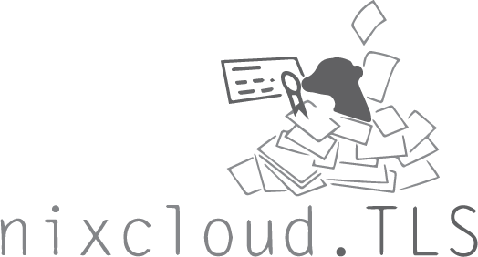

# nixcloud.TLS

`nixcloud.TLS` unifies TLS certificate management in NixOS.

The motivation for creating `nixcloud.TLS` was:

* Easy to use, no longer manual certificate management

* Easily switch between 'ACME', 'selfsigned' or 'usersupplied' scenarious:

    This makes it easy for testing (using selfsigned TLS certificates) and production (using "ACME" or you own certificates) configurations

* Because of the [ACME rate limits](https://letsencrypt.org/docs/rate-limits/) we try to minimize the amount of requests

**Note:** `nixcloud.TLS` makes `security.acme` obsolete. 

**Note:** `nixcloud.TLS` is meant to be used with `nixcloud.reverse-proxy` running on port 80. If you instead decide to run `services.nginx` on port 80 a lot of assumptions won't work and we can't support that. See [issue 23](https://github.com/nixcloud/nixcloud-webservices/issues/23) on that matter. You can use `nixcloud.webservices.nginx` or `nixcloud.webservices.apache` instead but keep in mind that your webservice must be configured to run behind a reverse-proxy.

## How to use nixcloud.TLS

The simplest configuration would be this:

    nixcloud.TLS.certs = {
      "nixcloud.io" = {};
    };

Here the identifier is the left hand string, "nixcloud.io" and the attribute set on the right is basically empty. As a result the configuration will be using default values where `domain` will be set to the identifier and `mode` will be "ACME".

A more complex example configuration for `nixcloud.TLS` would be:

    nixcloud.TLS = { 
      # this global email will be used if not overriden by certs record
      email = "global@example.com";
      certs = {
        "example.com-ACME" = {
          domain = "example.com";
          mode = "ACME";
          reload = [ "postfix.service" "myservice.service" ];
        };
        "example.com-selfsigned" = {
          domain = "example.com";
          mode = "selfsigned";
          email = "foo@example.com";
        };
        "example.com-usersupplied" = {
          domain = "example.com";
          mode = {
            tls_certificate="/root/.tls/fullchain.pem";
            tls_certificate_key="/root/.tls/key.pem";
          };
          email = "foo@example.com";
        };
      };
    };
    
As said, the default value for `domain` is the `identifier`. It would not make sense in any of the above examples as "example.com-ACME" is not a correct domain therefore the `domain` is set explicitly to "example.com" in each example. In `nixcloud.TLS.certs."nixcloud.io" the domain is set to "nixcloud.io" which is a correct domain and an intended default. The
    
The `reload` example for "example.com-ACME" adds two services, "postfix.service" and "myservice.service" to the [postrun](https://nixos.org/nixos/options.html#security.acme.certs.%3Cname%3E.postrun) hook. If you would use `nixcloud.email` and `nixcloud-webservices` it would contain [ "postfix.service" "dovecot2.service" "nixcloud.reverse-proxy" "myservice.service" ] as it accumulates all defined services and applies `lib.unique` to the list.
    
The example above creates three certificates for the same domain. The certificates can be found in:

* `/var/lib/acme/example.com-ACME/`
* `/var/lib/nixcloud/TLS/example.com-selfsigned/selfsigned`
* `/var/lib/nixcloud/TLS/example.com-usersupplied/usersupplied`

But they should be referenced using:

* `config.nixcloud.TLS.certs."identifier".tls_certificate` 

Since the `nixcloud.TLS` abstraction will return the correct location according to the `mode` of operation.

## Different usage modes in detail

If you are using `nixcloud-webservices` or `nixcloud.email` you will be using `nixcloud.TLS` without knowing it as we use it as a default from now on.

### Using ACME certificates

    nixcloud.TLS.certs = {
      "example.com" = {
        mode = "ACME";
        email = "foo@example.com";
      };
    };

### Using 'usersupplied' certificates

    nixcloud.TLS.certs = {
      "example.com" = {
        mode = {
          tls_certificate="/root/.tls/fullchain.pem";
          tls_certificate_key="/root/.tls/key.pem";
        };
        email = "foo@example.com";
      };
    };
    
### Using 'selfsigned' certificates

    nixcloud.TLS.certs = {
      "example.com" = {
        mode = "selfsigned";
      };
    };
    
**Note:** `security.acme` also creates a self-signed certificate but if your testing environment can't successfully use ACME to replace it with a valid
      certificate it will always report `simp_le` errors on `nixos-rebuild switch` updates and this is the reason we created a self-signed implementation.

## Using nixcloud.TLS with any NixOS service

This section is for users who have a service as murmur (mumble backend) which is in nixpkgs and won't be tunneled trough `nixcloud.reverse-proxy`. Generally a servic e like https://nixos.org/nixos/options.html#ssl+cert, so basically a custom TLS configuration. 

This brief guide shows how to manage your certificates using `nixcloud.TLS` in that case.

In a nutshell, you need to do three things:

1. Create a nixcloud.TLS.certs."identifier" record and pick your `mode` of operation
2. In the service, reference the `tls_certificate` and `tls_certificate_key` from the global `config`
3. Inject systemd service dependencies 

### nixcloud.TLS configuration

    nixcloud.TLS.certs = {
      "example.org" = {
        mode = "ACME";
        users = [ "murmur" ];
        reload  = [ "myservice1.service" ];
        restart = [ "myservice2.service" ];
      };
    };

**Note:** It is important to list all the users, like murmur, so NixOS services which are not started as root still can access the certificates! A list of such user names can be found in https://github.com/NixOS/nixpkgs/blob/master/nixos/modules/misc/ids.nix!
**Note:** It is important that you list your systemd services in `reload` or `restart` so they get reloaded or restarted once a new certificate arrives.

### Referencing certificate/key

If you want to reference a `tls_certificate` or a `tls_certificate_key` you can use the `nixcloud.TLS` 
identifier (string) with the `config` variable:
    
    sslServerCert = config.nixcloud.TLS.certs."example.org".tls_certificate;
    sslServerKey  = config.nixcloud.TLS.certs."example.org".tls_certificate_key;
    
**Note:** Most often the identifier "example.org" is the same as the the domain you want to have a certificate for. However, using such identifier you can easily issue several different certificates for the same domain. You must use the quotes, so that "example.org" is a single attribute in the Nix attribute path!

### Systemd dependencies injection

You also need to inject the systemd dependencies so that both `nixcloud.TLS` or `security.acme` has enough time to allocate the 
certificates before they are used from a daemon.

Here is an example how one would extend `postfix`:

    systemd.services.postfix.after = [ "nixcloud.TLS-certificates.target" ];
    systemd.services.postfix.wants = [ "nixcloud.TLS-certificates.target" ];

**Note:** This code was copied from `nixcloud.email`.
    
The "nixcloud.TLS-certificates.target" waits for these 4 targets to finish:

* security.acme:

    * `acme-selfsigned-certificates.target` 
    * `acme-certificates.target`

* nixcloud.TLS:

    * `nixcloud.TLS-selfsigned.target`
    * `nixcloud.TLS-usersupplied.target`

**Note:** Most services in nixpkgs using `security.acme` lack the former two target dependencies and if you deploy a server for the first time the services might and probably will fail to start since there won't be any certificates in place for the configured cert/key pair yet. This is a race condition we'd like to fix in the future.

## Debugging

These commands might come in handy:

    systemctl list-units --type=target
    systemctl status nixcloud.TLS-certificates.target
    systemctl status nixcloud.TLS-usersupplied-certificates.target
    systemctl status nixcloud.TLS-selfsigned-certificates.target
    systemctl status nixcloud.TLS

# Thanks

Thanks to:

* `security.acme` authors 
* uwap
* eliasp
