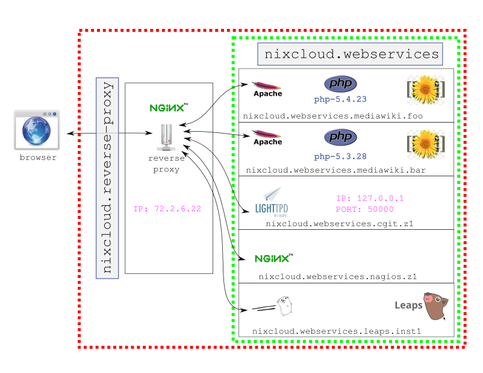

# nixcloud.webservices

`nixcloud.webservices` is a part of [nixcloud-webservices](https://github.com/nixcloud/nixcloud-webservices) and focuses on automated deployment of traditional webservices as wordpress, owncloud, [mediawiki](../modules/web/services/mediawiki/default.nix) or [leaps](../modules/web/services/leaps/default.nix) which is implemented in GO and comes with its own webserver implementation.

See also [../README.md](../README.md).

# Using nixcloud-webservices

1. nixcloud.webservices.mediawiki

    Add this code to your `/etc/nixos/configuration.nix` file:

        nixcloud.reverse-proxy = {
          enable = true;
          extendEtcHosts = true;
        };

        nixcloud.webservices.mediawiki.test1 = {
          enable = true;

          proxyOptions = {
            port   = 40000;
            path   = "/wiki";
            domain = "example.com";
          };
        };

    Warning: Using `extendEtcHosts = true;` extends `/etc/hosts` and if you use 'nixos.org' as example domain you won't be able to visit the official 'nixos.org' webpage from that machine!

2. Rebuilding to use `nixcloud.webservices`

    If you've used the above example as is, you can simply do:

        nixos-rebuild switch

    Finally visit:

        https://example.com/wiki

    or

        http://localhost:40000/wiki

3.  Upload files / logging 

    * static files:

          uploads (static files) can be found in `${stateDir}` which is `/var/lib/nixcloud/webservices/mediawiki-test1`

    * logging:

            ls /var/lib/nixcloud/webservices/mediawiki-test1/log 
            access_log  error_log

    * debugging

            journalctl -u mediawiki-test1-apache

# Static file serving (no CGI)

If you need static file serving there are two backends available:

* darkhttpd
* nginx

## static-darkhttpd

Using `darkhttpd` backend:

    nixcloud.webservices.static-darkhttpd.example1 = {
      enable = true;
      root = /www;
      proxyOptions = {
        port = 3032;
        http.mode = "on";
        https.mode = "off";
        domain = "example.com";
      };
    };

Note: If `root` is not set it falls back to serve `/var/lib/nixcloud/webservices/static-darkhttpd-example1/`. 
This has the advantage that you don't have to manually alter directory/file permissions so that the webserver has access to it. Default user/group will be `static-darkhttpd-example1-webserver`.
    
## static-nginx    
    
Using `nginx` backend:
    
    nixcloud.webservices.static-nginx.example2 = {
      enable = true;
      root = /www;
      proxyOptions = {
        port = 3032;
        http.mode = "on";
        https.mode = "off";
        domain = "example.com";
      };
    };
    
Note: If `root` is not set it falls back to serve `/var/lib/nixcloud/webservices/static-nginx-example2/`. 
This has the advantage that you don't have to manually alter directory/file permissions so that the webserver has access to it. Default user/group will be `static-nginx-example2-webserver`.
            
# Extending nixcloud-webservices

You have basically two options:

* Hack your implementation into your clone of `nixcloud.webservices`, example:
    * [mediawiki](../modules/web/services/mediawiki/default.nix) (traditional 'apache')
    * [leaps](../modules/web/services/leaps/default.nix) (GO implements a webserver basically)

    When `nixcloud-webservices` is updated, you can do a 'git pull --rebase' in your branch:
    * You can integrate any programming language which implements a webserver interface (http).
    * You can also extend apache with `mod_python`, see the trac example in nixpkgs.
    
* Use `nixcloud.webservices` as a library which is illustrated in [../tests/custom-webservice.nix](../tests/custom-webservice.nix)

    Note: The library usage scenario quite simple to use, we'd recommend this, especially if you don't plan to commit your code into `nixcloud-webservices` later.

# Technological background

All `services` in the namespace `nixcloud.webservices` hold the `special properties` as listed below. See also [nixcloud.webservices.development.rst](nixcloud.webservices.development.rst) on the module system extension.

## Multiple instantiation of webservices like `mediawiki`

A primary design goal is to easily support 'multiple instances' of the same webservice (mediawiki), yet isolated from each other. This is a cool feature but requires to 'fork' most webservices coming with `nixpkgs` for the time being.

This example would create two mediawiki based webservices:

    nixcloud.webservices.mediawiki.test1 = {
      enable = true;

      proxyOptions = {
        port   = 40000;
        path   = "/wiki";
        domain = "example.com";
      };
    };
    nixcloud.webservices.mediawiki.test2 = {
      enable = true;

      proxyOptions = {
        port   = 40001;
        path   = "/wiki2";
        domain = "example.com";
      };
    };    

## Reverse-proxy setups

Each webservice runs in its own webserver on a different `port`. Using `nixcloud.reverse-proxy` all these different ports are consolidated into a reverse-proxy (single webserver) which runs on port 80/443 and interconnects the services to the outside world.

One can now easily change the URL from `example.com/` to `example.org/foo` (and back) without having to modify the webservice itself.

    nixcloud.webservices.leaps.myservice = {
      enable = true;
      proxyOptions = {
        port   = 50000;
        path   = "/foo";
        domain = "example.com";
      };
    };
        
The options `port`, `path` and `domain` must to be set always while options like `ip` and others are optional. The `port` has a special role as it can't be assigned automatically using the nix programming language yet. One possible solution we work on would be to use /etc/portmap and inside service reference a 'name' instead of a port number which is then translated into a number using the said /etc/portmap.

See also [nixcloud.reverse-proxy.md](nixcloud.reverse-proxy.md).

## systemd

Each webservice is closely associated with systemd service(s), making it easy to shutdown/restart individual services. This decoupling makes it rather easy to manage single services in a multi-tenant environment without having these interfering with each other. This makes user/group isolation per webservice easy!

For example: `mediawiki` is using the apache web server and can be controlled using various services/targets:

    systemctl cat mediawiki-test1

try:

    systemctl status mediawiki-test1
    journalctl -u mediawiki-test1

## Database abstraction for user/db creation:

  * [main module](../modules/web/database/default.nix)
  * [postgresql implementation](../modules/web/database/postgresql.nix)
  * [mysql implementation](../modules/web/database/mysql.nix)

  Note: We spawn a custom database per webservice by default and `nixcloud.webservices.mediawiki` contains an test which is also an example how to use both mysql and postgresql in one webservice and how to make it a user choice which one to use.

  * FIXME: give usage example from ./modules/web/services/mediawiki/default.nix on how to access either

  * FIXME: how to access the database from command line for dumps or manual SQL queries

  * FIXME: add example how to add a new database backend

## A common webservice interface: `apache`, `nginx`, `lighttpd` & `darkhttpd`:

The [common interface](../modules/web/core/webserver.nix) features web servers as:

* [apache](../modules/web/webserver/apache.nix)
* [nginx](../modules/web/webserver/nginx.nix) 
* [lighttpd](../modules/web/webserver/lighttpd.nix)
* [darkhttpd](../modules/web/webserver/darkhttpd.nix)

which support the same subset of `mkOptions` so the webservice developers can easily migrate services between the supported webservers. Of course there are differences such as `.htaccess` which are solely supported by `apache` and thus implementation details might be bound to a particular webserver. Also darkhttpd might be better suited for static serving of files.

See https://github.com/nixcloud/nixcloud-webservices/commit/2d0a3ada705b36521a1eceb803e8c6737f47b21f on how to add a new backend (darkhttpd) and use it in an new webservice (static-darkhttpd).

## Testing webservice

There are suitable CI tests using [curl](https://curl.haxx.se/)/[selenium](https://github.com/SeleniumHQ/selenium), see [../tests/README.md](../tests/README.md)

In a nutshell you can run a test explicitly like this:

    cd nixcloud-webservices/tests
    nix-build -A custom-webservice

To make testing easier we made them part of the evaluation: 
     
   * when using `nixcloud.webservices.leaps`, it will always run the respective [test.nix](https://github.com/nixcloud/nixcloud-webservices/blob/master/modules/web/services/leaps/test.nix) (leaps) to make sure it works in general
   * if you are using `nixcloud.reverse-proxy` it will always run the reverse-proxy test before

WARNING: `nixcloud.webservices` is best used on a machine with native virtualization support (KVM) but you can still use it from within a VM, it just takes longer to evaluate.

## stateDir(s)

Each webservice gets a unique, stateful directory called `stateDir`.
 
For instance two owncloud based webservices called `service1` and `service2` would use: `/var/lib/nixcloud/webservices/owncloud-service1` and `/var/lib/nixcloud/webservices/owncloud-service2` thus not interfere.
The `stateDir` is independent of the `URL` and thus not influenced by `proxyOptions`.
    
Using `nixcloud.webservices.owncloud.service1` would create `/var/lib/nixcloud/webservices/owncloud-service1` and while `owncloud` would be the service class, `service1` would be a name, which has to be unique, given by the user. 

Using ACLs we made sure, that mixed permissions of file user/group ownership won't screw your webservice. So files in `/var/lib/nixcloud/webservices/owncloud-service1` will always be accessible for the user `owncloud-service` no matter what user/group created it.

## Startup script helpers

Startup scripts are used to prepare the environment or perform updates, are executed as a special user (not as a privileged user like root).

    webserver.startupScript = ''
      ${config.webserver.apache.phpPackage}/bin/php ${mediawikiRoot}/maintenance/update.php
    '';

See also the implementation [mediawiki](../modules/web/services/mediawiki/default.nix).
    
## Configuration syntax checking

We introduce `nix evaluation time` configuration syntax checking for `apache`, `nginx` & `nixcloud-reverse-proxy`

  * [nginx_check_config.nix](../modules/web/webserver/lib/nginx_check_config.nix)
  * [apache_check_config.nix](../modules/web/webserver/lib/apache_check_config.nix)
  
So when you start packaging your own webservice you will see configuration errors much earlier and don't have to deploy your service in order to see that there is a configuration error when nginx or apache starts up but instead you will already see many common errors when the configuration is generated.

A simple example for a broken nginx configuration:

    nixcloud.reverse-proxy = {
      enable = true;
      extendEtcHosts = true;
      extraConfig = ''
        this should break the config {{{{
      '';
    };

A `nixos-rebuild switch` will fail with this error:

    =========== nginx syntax check fail ===========
    nginx: could not open error log file: open() "/nix/store/nn2fsp8z584b4ir2lqma95zk98vzb7w4-nginx-1.12.2/logs/error.log" failed (13: Permission denied) 2018/03/07 01:53:51 444#444: the "user" directive makes sense only if the master process runs with super-user privileges, ignored in /nix/store/5rdc8k4rvfw5hjcfcg5lvwiszlnm7pv2-nginx_check_config/nixcloud.reverse-proxy.conf_:3 2018/03/07 01:53:51 444#444: unknown directive "this" in /nix/store/5rdc8k4rvfw5hjcfcg5lvwiszlnm7pv2-nginx_check_config/nixcloud.reverse-proxy.conf_:102 nginx: configuration file /nix/store/5rdc8k4rvfw5hjcfcg5lvwiszlnm7pv2-nginx_check_config/nixcloud.reverse-proxy.conf_ test failed
      -> /nix/store/5rdc8k4rvfw5hjcfcg5lvwiszlnm7pv2-nginx_check_config/nixcloud.reverse-proxy.conf
    =========== /nginx syntax check fail ===========
    You need to fix your nginx configuration!!1!

It is a bit tricky to read the error message but the error is at line 102 and the 'broken' nginx configuration file remains in the nix store until the garbage collector is run.
    
## Subdirectory support

Each `nixcloud.webservice` must be designed to run either with:

* path = "/"
* path = "/something"

So from the web, this looks like:

* https://example.com/
* https://example.com/something

See [mediawiki](../modules/web/services/mediawiki/default.nix) where we generate a different `Alias` directive based on the `config.proxyOptions.path` variable.

## Transparent licenses

Since we embrace FLOSS at nixcloud we've added a meta record to each webservice and enforce the license attribute and maintainer to be set.

# API stability

WARNING: The nixcloud.reverse-proxy's `proxyOptions` API and `nixcloud.webservices` related API is not stable yet. This means that futher updates break your services. This is caused by the fact that
we spent months in developing `nixcloud.webservices` and related technologies and coming with the release of `nixcloud.webservices` we want to pinpoint the usage scenarios and stabalize the API afterwards.

WARNING: We are aware of https://github.com/NixOS/nixpkgs/issues/24288#issuecomment-289032210 and we will fix this here as well.
 

